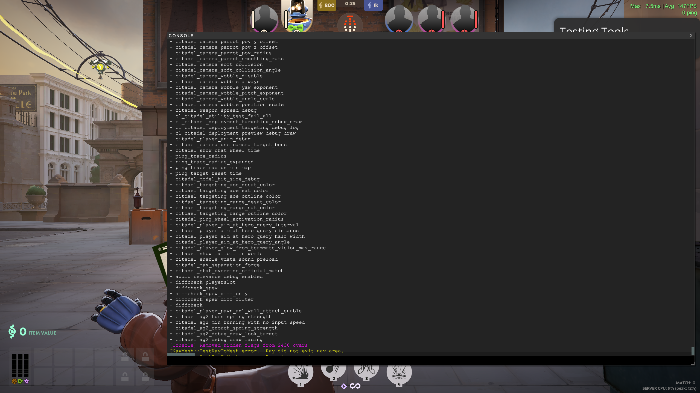

# cvar-unhide-s2



A Source 2 plugin to reveal all console variables and commands that are marked as hidden or development-only in Deadlock.

> [!IMPORTANT]
> You must add `-insecure` to deadlock's launch options for this plugin to load.

## Supported game

- Deadlock

## Installation

0. **Download the latest release of the plugin**: \
   clone the deadlock branch \
   ``` git clone --single-branch --branch dealock https://github.com/AltimorTASDK/cvar-unhide-s2.git ```
   

1. **Build the solution using visual studio.**

   - 📂 `$STEAM\steamapps\common\deadlock\game\citadel`

   
2. After build there should be an `addons` folder in the game folder, e.g. `deadlock deadlock\game\citadel\addons\...`

3. **Update the `game\citadel\gameinfo.gi` file**: \
   Around line 22, add the `Game citadel/addons` search path. This tells the engine to load the plugin before loading Deadlock.

   ```diff
   FileSystem
   {
   	SearchPaths
   	{
   		

   +		Mod	citadel
   +		Write	citadel
   +		Game	citadel/addons
   		Game	citadel
   		Game	citadel
   ```

4. **Start the game from Steam.**
   > [!WARNING]
   > citadel must be launched with `-insecure` in the launch options. If you don't know how to do this, take a look this [Steam Community guide](https://steamcommunity.com/sharedfiles/filedetails/?id=379782151).

If you want to disable cvar-unhide-s2:

- Remove the `Game	citadel/addons` line from the gameinfo.gi file.
- Remove `-insecure` from the game's launch options.

## Available commands

If you installed the plugin correctly, you should now be able to use the following commands in the console:

- **cvar_unhide**: Reveal all hidden/development-only convars/concommands.
- **cvarlist_md**: Write all concmds/cvars to a `cvarlist.md` file in the `citadel` game directory. See [cvarlist.md](./cvarlist.md) for example output.
